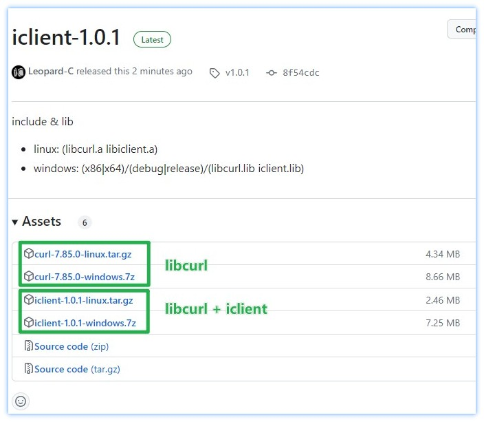

## iClient (iC Client)

【C++】基于`libcurl`的HTTP请求客户端。

## 0. 说明

+ C++版本：`c++11`
+ 支持`Windows`和`Linux`
+ 引入方法：`#include "iclient/ic.h"`

## 1. 功能与特点

+ HTTP、POST、PUT、DELETE、HEAD请求
+ 是否重定向，及重定向最大次数
+ 超时（毫秒）
+ SSL证书和密钥
+ 验证HTTPS请求对象的合法性
+ HTTP(s)代理
+ 接受的内容编码方式 (Accept-Encoding)
+ Cookie
+ Post请求数据（可设置MIME类型）
+ 自定义传输进度处理（例如下载进度条）
+ 文件下载（普通下载、断点续传、分片下载）
+ 限制下载/上传速度

## 2. 关键命名空间与类

+ namespace `ic`：
  + namespace `client`：
    + namespace `http`
      + enum `Method`: GET/POST/HEAD/...
      + enum `StatusCode`: HTTP状态码
      + enum `Version`: V1_0/V1_1/V2_0/...
    + namespace `util`
    + enum `Status`: Request请求的状态码（如超时、DNS错误等）
    + struct `ProxyData`: 描述一个HTTP(s)代理的相关信息
    + class `Request`
    + class `Response`
    + class `Executor`: 真正执行Request请求
    + class `Url`: 封装URL对象，便于添加、合并参数

## 3. 编译构建

如果机器上没有安装`libcurl`，可以在 [Release页面](https://github.com/Leopard-C/iclient/releases/tag/v1.0.1) 下载。



下载后，将静态库文件放在`lib`目录下，目录结构如下：

```shell
lib
├── linux
│   └── libcurl.a
└── windows
    ├── Win32
    │   ├── Debug
    │   │   └── libcurl.lib
    │   └── Release
    │       └── libcurl.lib
    └── x64
        ├── Debug
        │   └── libcurl.lib
        └── Release
            └── libcurl.lib
```


+ `linux`平台：

```shell
# 使用makefile
make iclient     # 编译静态库文件 (lib/linux/libiclient.a)
make example.out # 编译示例代码 (bin/example.out)

# 也可以使用xmake构建
xmake f -m release
xmake b iclient
xmake b example.out
```

+ `windows`平台：

使用`Visual Studio 2019`打开`win-build/iclient.sln`解决方案。

编译`iclient`项目生成静态库文件 （lib/windows/x64/Release/iclient.lib）

编译`example`项目生成示例程序 （bin/example.exe）


## 3. 简单使用

可以参考 `example/`目录下的文件

```shell
$ tree example
example
├── main.cpp
├── test_download.cpp
├── test_download_range.cpp
├── test_download_resume.cpp
├── test_download_speed_limit.cpp
├── test_http_get.cpp
├── test_http_post.cpp
├── test_http_put.cpp
└── test_url.cpp
```

### 3.1 `ic::client::Url`的使用

例如需要构造一个URL，`https://api.icrystal.top/util/random?min=1&max=100&count=20`，该链接含有3个参数。

```C++
ic::client::Url url("https://api.icrystal.top/util/random");
url.SetParam("min", 1);
url.SetParam("max", 100);
url.SetParam("count", 20)

// 获取合并的参数串
// "min=1&max=100&count=20"
url.GetParamsString();

// 获取整个URL字符串
// "https://api.icrystal.top/random?min=1&max=100&count=20"
url.ToString();
```

<font color="red">注意 !</font>

+ AddParam: 添加参数，保留同名的其他参数，如：

```C++
AddParam("name", "Tom");   "name=Tom"
AddParam("name", "Jack");  "name=Tom&name=Jack"
```

+ setParam: 唯一参数，覆盖同名的参数值。

```C++
SetParam("name", "Tom");  "name=Tom"
SetParam("name", "Jack"); "name=Jack"
```

### 3.2 GET/POST请求

GET请求

```C++
ic::client::Request request("http://httpbin.org/ip");
//request.set_http_method(ic::client::http::Method::HTTP_GET); // 默认为GET请求
ic::client::Response res = request.Perform();

if (res.status() == ic::client::Status::SUCCESS && 
   res.http_status_code() == ic::client::http::StatusCode::HTTP_200_OK)   // 等价于 if (res.ok()) { ... }
{
	std::cout << res.data() << std::endl;
}
```

POST请求

```C++
ic::client::Request request("http://httpbin.org/ip");
request.set_http_method(ic::client::http::Method::HTTP_POST);
```

### 3.3 设置/获取header

Header名称不区分大小写！

```C++
// 设置Request的header
request.set_header("User-Agent", "Mozilla/5.0 (Windows NT 10.0; Win64; x64) Ap...");
request.set_header("referer", "https://www.biaud.com");
auto res = request.Perform();

// 获取Response的header
// std::map<std::string, std::string>
auto& headers = res.headers();
for (auto& header : headers) {
    std::cout << header.first << ": " << header.second << std::endl;
}
res.HasHeader("Content-Length"); // true
res.GetHeader("Content-Length"); // 10134
```

### 3.4 设置代理

```C++
struct ProxyData {
    ProxyType type = ProxyType::HTTP;
    uint32_t port;
    HttpAuthType auth_type = HttpAuthType::ANY;
    std::string host;
    std::string username;
    std::string password;
};

ProxyData proxy_data;
proxy_data.host = "11.12.13.14";
proxy.data.port = 3011;
proxy.type = ic::client::ProxyType::HTTP;
request.set_proxy(proxy_data);

// 或者
request.set_proxy("11.12.13.14", 3011, ic::client::ProxyType::HTTP);
```

### 3.5 设置Cookie

```C++
request.set_cookie("name=Tom&age=18");
request.set_cookie_file("/etc/xxx/cookie/12345.cookie");
```

### 3.6 设置Post Data

```C++
request.set_data("{\"name\":\"Tom\"}");
```

### 3.7 重定向（次数）

```C++
request.set_max_redirects(3);   // 最多重定向3次
request.set_max_redirects(0);   // 设为0，表示禁止重定向
request.set_max_redirects(-1);  // 设为-1，表示不限制重定向次数（默认）
```

### 3.8 HTTPS验证

```C++
request.set_verify_ssl_host(false);
request.set_verify_ssl_peer(false);
request.set_verify_ssl_status(false);
request.set_verify_ssl(false); // 等价于上面三条语句
```

### 3.9 下载文件

```C++
// @downloadFile: 下载的本地文件名
// @resume(bool): 是否启用断点续传，默认不启用
request.set_download_file("output.jpg"/*, false*/);

// @range: 单位bytes
// 包括0和4095
request.set_download_range(0, 4095);
```

### 3.10 设置传输进度回调函数

```C++
request.set_transfer_progress_handler(url_xfer_info_callback);
```

其中，`url_xfer_info_callback` 函数签名如下

```C++
 bool s_curl_xfer_info(
        const ic::client::Request& request,
        curl_off_t download_total_bytes,  /* 总共需要下载的字节数 */
        curl_off_t download_now_bytes,  /* 已经下载的字节数 */
        curl_off_t upload_total_bytes, /* 总共需要上传的字节数 */
        curl_off_t upload_now_bytes); /* 已经上传的字节数 */
```

### 3.11 更多设置项

可查看 `include/iclient/request.h`

## 4. example

`No.5 断点续传`

~~如果服务器不支持断点续传，会返回错误 `ic::Status::NOT_SUPPORT_DOWNLOAD_RESUME_OR_RANGE`~~


`No.6 分片下载`（可以放到不同的线程中同时下载，即多线程下载）

~~如果服务器不支持分片下载，会返回错误 `ic::Status::NOT_SUPPORT_DOWNLOAD_RESUME_OR_RANGE`~~


## END

<leopard.c@outlook.com>

