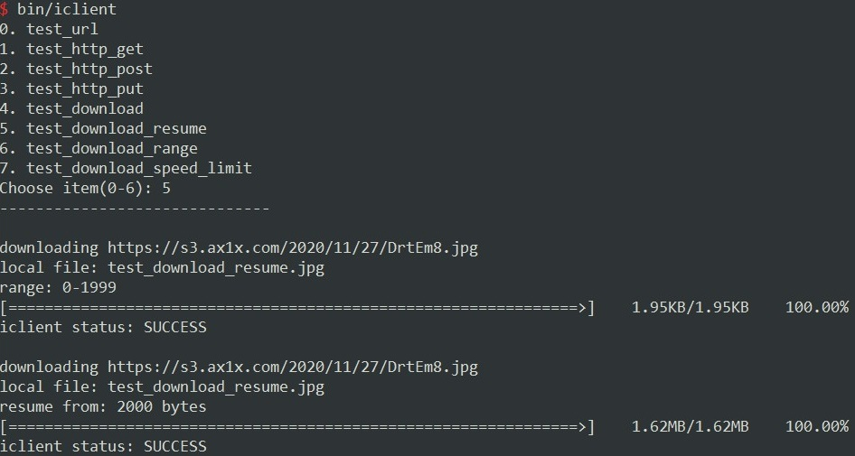
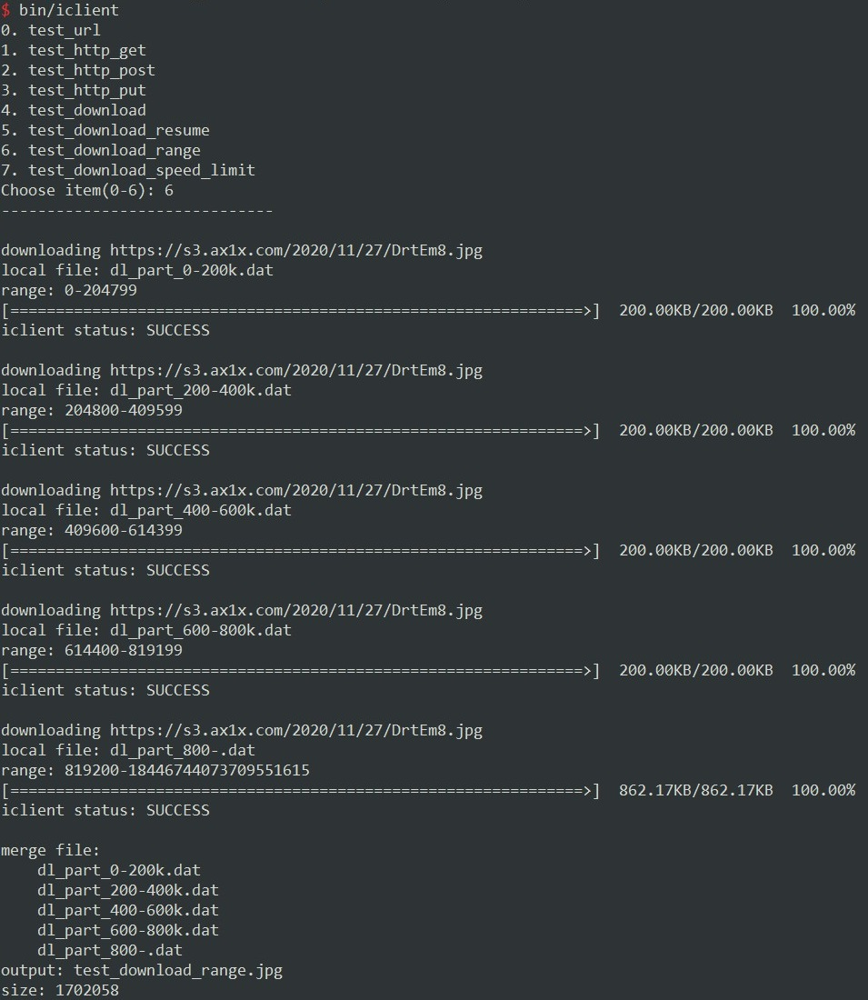

## iClient (iC Client)

【C++】封装`libcurl`

## 0. 说明

+ C++版本：`c++11`
+ 支持`Windows`和`Linux`
+ 引入方法：`#include "iclient/ic/ic.h"`

## 1. 功能与特点

+ HTTP、POST、PUT、DELETE、HEAD请求
+ 是否重定向，及重定向最大次数
+ 超时（毫秒）
+ SSL证书和密钥
+ 验证HTTPS请求对象的合法性
+ HTTP(s)代理
+ 接受的内容编码方式 (Accept-Encoding)
+ Cookie
+ Post请求数据（可设置MIME类型）
+ 自定义传输进度处理（例如下载进度条）
+ 文件下载（普通下载、断点续传、分片下载）

## 2. 关键命名空间与类

+ namespace `ic`：
  + namespace `http`
    + enum `method`: GET/POST/HEAD/...
    + enum `StatusCode`: HTTP状态码
    + enum `Version`: V1_0/V1_1/V2_0/...
  + namespace `util`
  + enum `Status`: Request请求的状态码（如超时、DNS错误等）
  + struct `ProxyData`: 描述一个HTTP(s)代理的相关信息
  + class `Request`
  + class `Response`
  + class `Executor`: 真正执行Request请求
  + class `Url`: 封装URL对象，便于添加、合并参数

## 3. 简单使用

可以参考 `example/`目录下的文件

```shell
$ tree example
example
├── main.cpp
├── test_download.cpp
├── test_download_range.cpp
├── test_download_resume.cpp
├── test_http_get.cpp
├── test_http_post.cpp
├── test_http_put.cpp
└── test_url.cpp
```

### 3.1 ic::Url的使用

例如需要构造一个URL，`https://api.icrystal.top/random?min=1&max=100&count=20`，该链接含有3个参数。

```C++
ic::Url url("https://api.icrystal.top/random");
url.setParam("min", 1);
url.setParam("max", 100);
url.setParam("count", 20)

// 获取合并的参数串
// "min=1&max=100&count=20"
url.toParamString();

// 获取整个URL字符串
// "https://api.icrystal.top/random?min=1&max=100&count=20"
url.toString();
```

<font color="red">注意 !</font>

+ addParam: 添加参数，保留同名的其他参数，如：

```C++
addParam("name", "Tom");   "name=Tom"
addParam("name", "Jack");  "name=Tom&name=Jack"
```

+ setParam: 唯一参数，覆盖同名的参数值。

```C++
setParam("name", "Tom");  "name=Tom"
setParam("name", "Jack"); "name=Jack"
```

### 3.2 GET/POST请求

GET请求

```C++
ic::Request request("http://httpbin.org/ip");
//request.setMethod(ic::http::Method::GET); // 默认为GET请求
ic::Response res = request.perform();

if (res.getStatus() == ic::Status::SUCCESS && 
   res.getHttpStatus() == ic::http::StatusCode::HTTP_200_OK)
{
	std::cout << res.getData() << std::endl;
}
```

POST请求

```C++
ic::Request request("http://httpbin.org/ip");
request.setMethod(ic::http::Method::POST);
```

### 3.3 设置/获取header

Header名称不区分大小写！

```C++
// 设置Request的header
request.setHeader("User-Agent", "Mozilla/5.0 (Windows NT 10.0; Win64; x64) Ap...");
request.setHeader("referer", "https://www.biaud.com");

// 获取Response的header
// std::map<std::string, std::string>
auto& headers = res.getHeaders();
for (auto& header : headers) {
    std::cout << header.first << ": " << header.second << std::endl;
}
res.hasHeader("Content-Length"); // true
res.getHeader("Content-Length"); // 10134
```

### 3.4 设置代理

```C++
struct ProxyData {
    ProxyType type = ProxyType::HTTP;
    uint32_t port;
    HttpAuthType auth_type = HttpAuthType::ANY;
    std::string host;
    std::string username;
    std::string password;
};

ProxyData proxyData;
request.setProxy(proxyData);

request.setProxy(ic::ProxyType::HTTP, "11.12.13.14", "3011");
```

### 3.5 设置Cookie

```C++
request.setCookie("name=Tom&age=18");
request.setCookieFile("/etc/xxx/cookie/12345.cookie");
```

### 3.6 设置Post Data

```C++
request.setData("{\"name\":\"Tom\"}");
```

### 3.7 重定向（次数）

```C++
request.setFollowRedirects(5);  // 默认为-1，不限制次数
request.setFollowRedirects(0);  // 设为0，表示禁止重定向
```

### 3.8 HTTPS验证

```C++
request.setVerifySslHost(false);
request.setVerifySslPeer(false);
request.setVerifySslStatus(false);
request.setVerifySsl(false); // 等价于上面三条语句
```

### 3.9 下载文件

```C++
// @downloadFile: 下载的本地文件名
// @resume(bool): 是否启用断点续传，默认不启用
request.setDownloadFile("output.jpg"/*, false*/);

// @range: 单位bytes
request.setDownloadRange("0-4096");
```

### 3.10 设置传输进度回调函数

```C++
request.setTransferProgressHandler(url_xfer_info_callback);
```

其中，`url_xfer_info_callback` 函数签名如下

```C++
 bool s_curl_xfer_info(
        const ic::Request& request,
        curl_off_t download_total_bytes,  /* 总共需要下载的字节数 */
        curl_off_t download_now_bytes,  /* 已经下载的字节数 */
        curl_off_t upload_total_bytes, /* 总共需要上传的字节数 */
        curl_off_t upload_now_bytes); /* 已经上传的字节数 */
```

### 3.11 更多设置项

可查看 `iclient/ic/ic_request.h`

## 4. example

`No.5 断点续传`

如果服务器不支持断点续传，会返回错误 `ic::Status::NOT_SUPPORT_DOWNLOAD_RESUME_OR_RANGE`




`No.6 分片下载`（可以放到不同的线程中同时下载，即多线程下载）

如果服务器不支持分片下载，会返回错误 `ic::Status::NOT_SUPPORT_DOWNLOAD_RESUME_OR_RANGE`




## END

<leopard.c@outlook.com>

